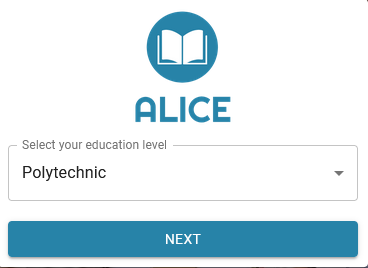
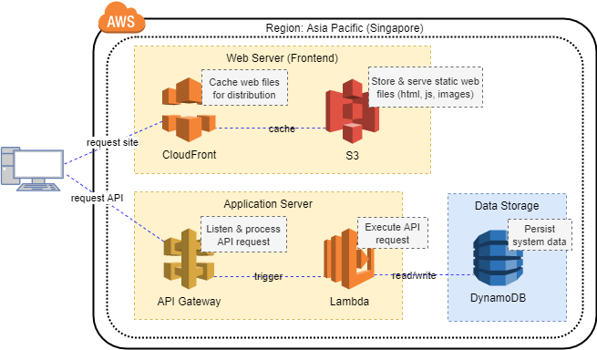

# ALICE 
A Lightweight Interactive Companion for Education

## About
ALICE is a SaaS web application that aims to aid Junior College (JC) or Polytechnic students to plan for their college education and graduation.



This [GitHub project](https://github.com/remns/cs5224-alice/) contains the code for ALICE. Application Demo: https://dutizh1sabqu4.cloudfront.net

## Code Overview
ALICE is architected as a Single-Page-Application, consisting of a React frontend and an API backend.

### Deployment
The frontend is hosted using S3 and distributed with CloudFront. The backend infrastructure consists of API Gateway, several Lambda functions and DynamoDB tables.



### CI/CD
The master branch of this project is automatically built and deployed to the live demo.

Frontend deployment: https://dutizh1sabqu4.cloudfront.net

Backend deployment: https://3jqms9dxp6.execute-api.ap-southeast-1.amazonaws.com/Prod

## Setting up a local environment
### Pre-requisite Tools
Following tools are required for local builds
- Docker
- AWS CLI (Configure region to ap-southeast-1)
- AWS SAM

[Installation Instructions](https://docs.aws.amazon.com/serverless-application-model/latest/developerguide/serverless-sam-cli-install.html)

### Backend - DynamoDB
Run a local instance of DynamoDb in a Docker container at http://localhost:8000
```
docker network create alice-network
docker run --network alice-network --name dynamodb -d -p 8000:8000 amazon/dynamodb-local
```

Install the necessary dependencies and return to root directory
```
cd backend
npm install
cd ../
```

Create Tables and initialise data
ALICE uses two tables, one for courses and one for course popularity tracking

Create table for course 'AliceCourseTable2' and initialise data
```
aws dynamodb create-table --table-name AliceCourseTable2 --attribute-definitions AttributeName=Id,AttributeType=N --key-schema AttributeName=Id,KeyType=HASH --provisioned-throughput ReadCapacityUnits=2,WriteCapacityUnits=2 --endpoint-url http://localhost:8000

node .\backend\tools\db\initCourseTable.js http://localhost:8000
```

Create table for popularity 'AliceClicksTable2' and initialise data
```
aws dynamodb create-table --table-name AliceClicksTable2 --attribute-definitions AttributeName=CourseId,AttributeType=N AttributeName=Clicks,AttributeType=N AttributeName=GsiPk,AttributeType=N --global-secondary-indexes "IndexName=ClicksIndex2,KeySchema=[{AttributeName=GsiPk,KeyType=HASH},{AttributeName=Clicks,KeyType=RANGE}],Projection={ProjectionType=ALL},ProvisionedThroughput={ReadCapacityUnits=2,WriteCapacityUnits=2}" --key-schema AttributeName=CourseId,KeyType=HASH --provisioned-throughput ReadCapacityUnits=2,WriteCapacityUnits=2 --endpoint-url http://localhost:8000

node .\backend\tools\db\initClicksTable.js http://localhost:8000
```

Verify that data has been loaded:
```
aws dynamodb scan --table-name AliceClicksTable2 --endpoint-url http://localhost:8000
aws dynamodb scan --table-name AliceCourseTable2 --endpoint-url http://localhost:8000
```

### Backend - API & Lambda functions
Run API locally at http://localhost:3001

```
cd backend
sam local start-api --env-vars env.json -p 3001 --docker-network alice-network --warm-containers EAGER
```

### Frontend
run frontend locally at http://localhost:3000
```
cd frontend
npm install
npm start
```

## Deploying ALICE to AWS
### Backend
ALICE uses CloudFormation to deploy its backend resources.

1. Create an S3 bucket to store CloudFormation packages
2. Package backend code
    ```
    cd backend
    aws cloudformation package --template template.yml --s3-bucket <YOUR_BUCKET_NAME> --output-template template-export.yml
    ```
3. Create a new CloudFormation stack using the template file ```template-export.yml``` generated in step 2.
    

### Frontend
Configure the URL for your API in the frontend environment file ```./frontend/.env```

#### AWS Setup
1. Create an S3 bucket to host frontend site
2. Enable static website hosting on bucket

#### Build & Deploy
Build the frontend and upload build files to S3 Bucket
```
cd frontend
npm build
aws s3 sync ./build <YOUR_BUCKET_NAME> --acl public-read && cd -
```

## Testing
1. Access the frontend site. ALICE will guide you through filling in the student profile and provide recommended courses.
2. Manually exercise the APIs. Postman scripts are available in /backend/tools/postman.
